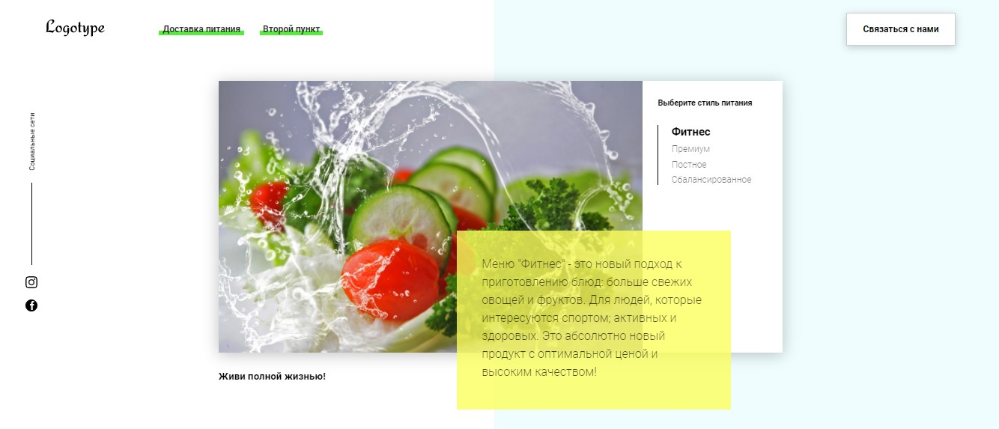
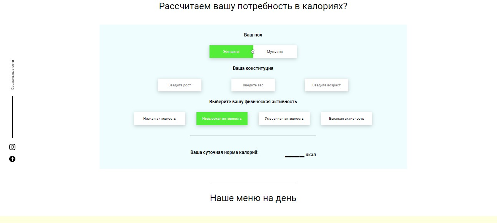

# "Healthy and Balanced Meal" personal project


### Installation

```
npm install
```

### Start Dev Server

```
npm start
```

### Build Prod Version

```
npm run build
```

### Features:
Healthy and Balanced Meal

